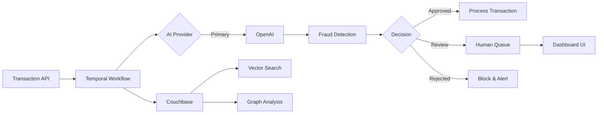
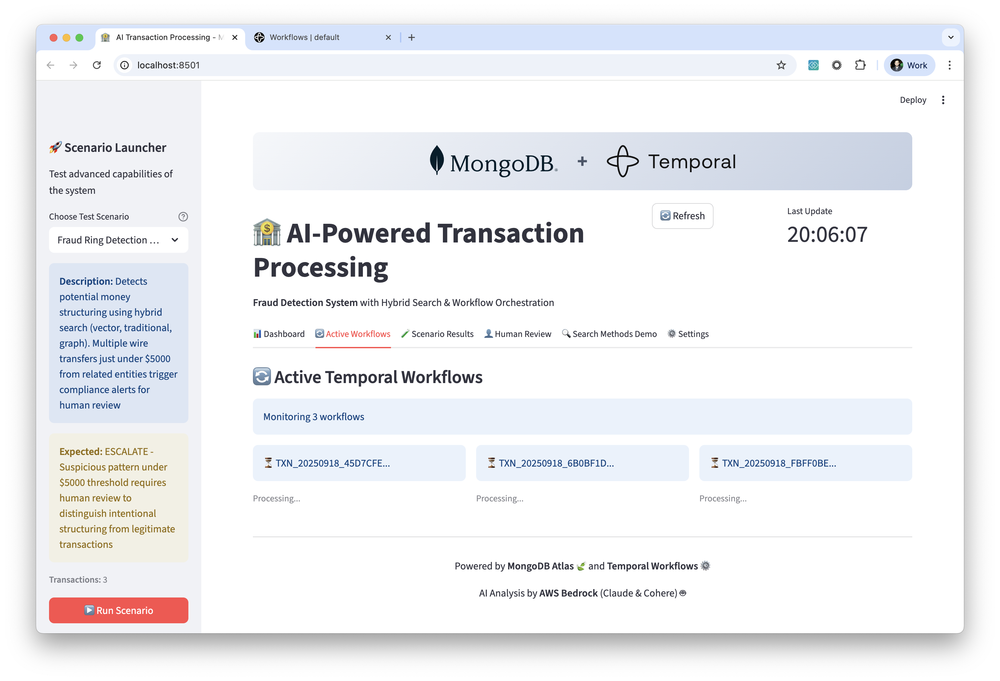

# AI-Powered Transaction Processing System – Proof of Value

Enterprise-grade financial fraud detection system that combines Couchbase vector search, Temporal workflows, and OpenAI AI to demonstrate real-time transaction analysis and intelligent fraud detection capabilities.

 

## Quick Start

```bash
# 1. Clone the repository
git clone https://github.com/
cd maap-temporal-ai-agent-qs

# 2. Configure environment (minimal setup)
cp .env.example .env
# Edit .env with your Couchbase connection string and OpenAI credentials

# 3. Run quick setup (creates venv, installs deps, starts Temporal on Docker and launch the app)
./scripts/quick_setup.sh

# or Run docker setup (Deploy everything on Docker and launch the app)
./scripts/docker_setup.sh
```

## Table of Contents

- [Overview](#overview)
- [Business Value & Use Cases](#business-value--use-cases)
- [Architecture](#architecture)
- [Installation & Configuration](#installation--configuration)
- [Usage](#usage)
- [Evaluation Guide](#evaluation-guide)
- [Troubleshooting](#troubleshooting)
- [Next Steps](#next-steps)
- [License](#license)

## Overview

**What It Does:** Processes financial transactions through an AI-powered decision pipeline that combines rule-based evaluation, vector similarity search, and advanced fraud detection to provide real-time approve/reject decisions with detailed reasoning.

**Business Value:**
- ✅ **Advanced fraud detection** through hybrid AI + vector search approach
- ✅ **Reduced operational costs** via automated transaction processing
- ✅ **Fast decision processing** with asynchronous workflows
- ✅ **Decreased manual review workload** through AI-assisted decisions
- ✅ **Complete audit trails** with explainable AI reasoning

**PoV Scope Limitations:**
- Mock data for demonstration (no real financial data)
- Single-region deployment (production would be multi-region)
- Performance not optimized for high throughput
- Basic notification system
- Simplified compliance checks (production requires full KYC/AML)

## Business Value & Use Cases

### Primary Scenarios Demonstrated

1. **Fraud Ring Detection** - Identifies coordinated criminal networks through graph traversal
2. **Real-time Risk Scoring** - AI-powered analysis with confidence scoring
3. **Automated Compliance** - Sanctions screening and regulatory checks
4. **Human-in-the-Loop** - Escalation workflows for complex cases
5. **Cost Optimization** - Reduces manual review while maintaining accuracy

### Expected Measurable Outcomes (KPIs)

| Metric | Description | PoV Demonstrates |
|--------|-------------|------------------|
| Detection Capability | AI-powered analysis | Multi-factor risk assessment |
| Processing Speed | Workflow execution time | Asynchronous processing |
| Auto-Approval | Transactions approved without manual review | Confidence-based decisions |
| Manual Review | Human-in-the-loop capability | Queue management system |
| Audit Trail | Decision tracking | Complete workflow history |

### Enterprise Alignment

- **Couchbase Integration:** Demonstrates vector search with Full-Text Search, ACID transactions, and N1QL queries
- **AI Workflow Orchestration:** Shows Temporal's reliability for mission-critical processes
- **Cloud-Native Architecture:** Ready for AWS/Azure/GCP deployment
- **Regulatory Compliance:** Built-in audit trails and explainability

## Architecture

### High-Level System Flow



### Key Components (PoV Scope)

- **FastAPI Backend** - REST API for transaction submission
- **Temporal Worker** - Durable workflow execution engine
- **Couchbase** - Document store with Full-Text Search and vector search capabilities
- **OpenAI** - LLM provider (GPT-4) for transaction analysis and embeddings (text-embedding-3-small)
- **Streamlit Dashboard** - Real-time monitoring and review interface

### Integration Points

- Couchbase Full-Text Search with 1536-dimensional vector indexes
- Temporal for workflow orchestration and retry logic
- OpenAI API for AI inference and embeddings
- RESTful APIs for external system integration

For detailed architecture documentation, see [docs/ARCHITECTURE.md](docs/ARCHITECTURE.md).

## Installation & Configuration

### Prerequisites

- Python 3.11+
- Docker & Docker Compose
- Couchbase Server or Couchbase Capella (Cloud)
- OpenAI API key
- 8GB RAM minimum

### Quick Setup (Docker)

```bash
# Start all services with Docker Compose
docker-compose up -d

# Verify services are running
docker ps
curl http://localhost:8000/health
```

### Local Development Setup

```bash
# Create virtual environment
python3 -m venv venv
source venv/bin/activate  # On Windows: venv\Scripts\activate

# Install dependencies
pip install -r requirements.txt

# Start Temporal (required)
cd docker-compose && docker-compose up -d && cd ..

# Initialize Couchbase
python -m scripts.setup_couchbase

# Start services (3 terminals needed)
python -m temporal.run_worker     # Terminal 1: Worker
uvicorn api.main:app --reload     # Terminal 2: API
streamlit run app.py               # Terminal 3: Dashboard
```

### Configuration

| Variable | Description | Default | Required |
|----------|-------------|---------|----------|
| `COUCHBASE_CONNECTION_STRING` | Couchbase cluster connection string | - | ✅ |
| `COUCHBASE_USERNAME` | Couchbase username | - | ✅ |
| `COUCHBASE_PASSWORD` | Couchbase password | - | ✅ |
| `COUCHBASE_BUCKET` | Couchbase bucket name | - | ✅ |
| `COUCHBASE_SCOPE` | Couchbase scope name | _default | ❌ |
| `OPENAI_API_KEY` | OpenAI API key for LLM and embeddings | - | ✅ |
| `OPENAI_MODEL` | OpenAI model for LLM (e.g., gpt-4o-mini) | gpt-4o-mini | ❌ |
| `OPENAI_EMBEDDING_MODEL` | OpenAI embedding model | text-embedding-3-small | ❌ |
| `CONFIDENCE_THRESHOLD_APPROVE` | Min confidence for auto-approval | 85 | ❌ |
| `AUTO_APPROVAL_LIMIT` | Max amount for auto-approval | 50000 | ❌ |
| `TEMPORAL_HOST` | Temporal server address | localhost:7233 | ❌ |

For complete configuration options, see [docs/CONFIGURATION.md](docs/CONFIGURATION.md).

## Usage

### Dashboard Interface

The system includes a comprehensive Streamlit dashboard for monitoring and managing transactions:

**Key Features:**
- 📊 **Real-time Metrics** - Monitor transaction volume, processing time, and AI confidence
- 🔍 **Hybrid Search Demo** - Visualize how different search methods work together
- 🚀 **Scenario Launcher** - Run pre-configured fraud detection scenarios
- 👥 **Human Review Queue** - Manage transactions requiring manual review
- ⚙️ **Active Workflows** - Track processing status in real-time

For detailed UI instructions, see the [UI Usage Guide](docs/UI_GUIDE.md).

### Basic Transaction Submission

```bash
# Submit a test transaction
curl -X 'POST' \
  'http://localhost:8000/api/transaction' \
  -H 'accept: application/json' \
  -H 'Content-Type: application/json' \
  -d '{
  "transaction_id": "2025092400001",
  "transaction_type": "wire_transfer",
  "amount": 100,
  "currency": "USD",
  "sender": {
    "account_number": "ACC-12345",
    "country": "US",
    "name": "Sam Eagleton"
  },
  "recipient": {
    "account_number": "ACC-67890",
    "country": "UK",
    "name": "Nigel Wadsworth"
  },
  "risk_flags": [],
  "reference_number": "95027064"
}'
```

### Demo Walkthrough: Fraud Detection

#### Step 1: Launch Scenario
Use the Scenario Launcher in the left sidebar to run pre-configured test cases:



Select "Fraud Ring Detection" and click "Run Scenario" to submit suspicious transactions.

#### Step 2: View Results
Monitor the scenario execution and see AI decisions:


The system detects structuring patterns and escalates transactions for review.

#### Step 3: Human Review
Review escalated transactions with AI recommendations:


Make informed decisions based on AI analysis and transaction details.

### Demo Scenario: High-Value Transaction

```bash
# Submit high-value transaction requiring manager approval
python -m scripts.advanced_scenarios

# Monitor in dashboard: http://localhost:8501
# Transaction will appear in "Pending Manager Approval" queue
```

### Monitoring Workflow Execution

1. **Streamlit Dashboard:** http://localhost:8501
   - Real-time transaction status
   - Decision distribution charts
   - Human review queue
   - Performance metrics

2. **Temporal UI:** http://localhost:8080
   - Workflow execution history
   - Activity retry details
   - Signal/query interface

3. **API Documentation:** http://localhost:8000/docs
   - Interactive API testing
   - Schema definitions
   - Response examples

## Evaluation Guide

### Core Flows to Test

1. **Automated Approval Path**
   - Submit low-risk transaction (<$5000, domestic)
   - Verify immediate approval
   - Check audit trail creation

2. **Fraud Detection**
   - Run velocity check scenario
   - Observe AI reasoning in dashboard
   - Validate similar transaction matching

3. **Human Review Workflow**
   - Submit medium-confidence transaction
   - Review in dashboard queue
   - Approve/reject with comments

4. **System Resilience**
   - Kill Temporal worker mid-transaction
   - Restart worker
   - Verify transaction completes successfully

### Success Metrics Checklist

- [ ] Test transactions processed successfully
- [ ] Fraud scenarios correctly identified (8/10 minimum)
- [ ] Human review queue updates in real-time
- [ ] Audit trail captures all decisions
- [ ] Vector search returns relevant similar transactions
- [ ] Manager escalation triggers for >$50K transactions

For detailed evaluation procedures, see [docs/EVALUATION_GUIDE.md](docs/EVALUATION_GUIDE.md).

## Troubleshooting

### Common Issues

| Problem | Cause | Solution |
|---------|-------|----------|
| Couchbase connection failed | Invalid connection string or credentials | Verify connection string, username, and password in .env |
| OpenAI API errors | Missing OpenAI API key | Ensure OPENAI_API_KEY is set in .env file |
| Worker not processing | Temporal not running | Run `docker-compose up -d` in docker-compose/ |
| Dashboard blank | API not accessible | Check API is running on port 8000 |
| Vector search no results | Missing FTS index | Run `python -m scripts.setup_couchbase` |

For detailed troubleshooting, see [docs/TROUBLESHOOTING.md](docs/TROUBLESHOOTING.md).

## Next Steps

### If PoV is Successful

**Scaling Considerations:**
- Deploy to Kubernetes for auto-scaling
- Implement multi-region Couchbase clusters with XDCR (Cross Data Center Replication)
- Add a caching layer for performance
- Configure CDN for dashboard assets

**Security Hardening:**
- Enable Couchbase encryption at rest and in-transit
- Implement OAuth2/SAML authentication
- Add rate limiting and DDoS protection
- Configure OpenAI API access and rate limits

**CI/CD Pipeline:**
- GitHub Actions for automated testing
- Docker image registry with vulnerability scanning
- Blue-green deployment strategy
- Automated performance regression testing

**Production Monitoring:**
- DataDog/New Relic APM integration
- Custom CloudWatch metrics and alarms
- PagerDuty incident management
- Grafana dashboards for business KPIs

## License

This project is licensed under the Apache License 2.0 - see the [LICENSE](LICENSE) file for details.

---

**Questions?** Contact the Solution Architecture team or open an issue in this repository.

**Ready to evaluate?** Start with the [Quick Start](#quick-start) section above.

>**Note:** This repository contains a reference implementation intended for educational and exploratory purposes only. It is **not production-ready** in its current form.
>
> While the architecture and design patterns demonstrated here reflect best practices for building AI-Powered Transaction Processing System, the implementation may lack:
>
> * Comprehensive test coverage
> * Robust error handling and validation
> * Security hardening and access controls
> * Performance optimizations for scale
> * Long-term support or upgrade guarantees
>
> **Use this as a foundation** to guide your own production implementations, but ensure thorough validation and customization before deploying in real-world environments.
